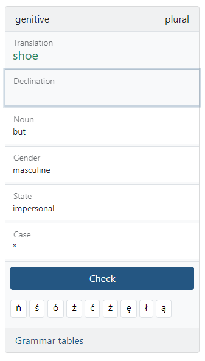
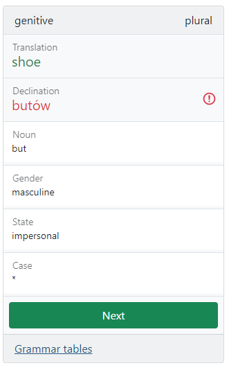
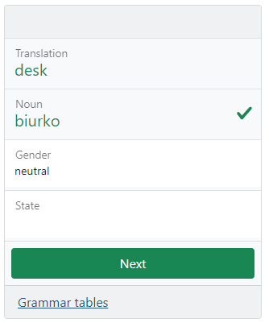
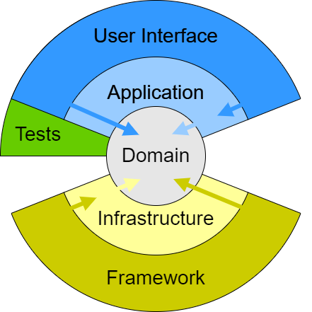

# LocaLingo

This is a **Duolingo**-like app to learn Polish declensions, with more than 500 words and their corresponding 5400 declensions.
It is intended to run locally from **Docker**, hence its name **LocaLingo** :rocket:.

**It learns** what words, cases or declinations you struggle with, to review them more frequently. 

Some screenshots:
<p>
  
  
  
</p>

## But, why?
**Duolingo** combined with a **flash-card** app is great for learning new languages.
Unfortunately, Slavic declension rules and grammar are hard to grasp from these applications for a latin language speaker.
Localingo was therefore built to solve my own needs to learn Polish, and should also be easily extendable to other languages with declension. 

## How to use it
Just clone the repository, run `make start` and open http://localhost:8099.     
That's it!

Your experience will be saved to `files/anonymous-experience.local.yaml` every time you finish an episode, would you want to reuse it.

## Framework agnostic, yes
This implementation is **framework agnostic**, applying **Domain Driven Design** patterns like **Hexagonal architecture** and enforcing
strict layers relations. This allows the *Framework*, or the *Infrastructure* components to be replaceable without requiring modifications to other layers.
     
The [Deptrac config file](depfile.yaml) describes and enforces layers relations.     
The following image illustrates the layers structure:



-------
# Contributing
## Starting the environment
Running `make start` will launch the containers and mount the root folder.     
Configure your IDE to execute PHP remotely on the container via ssh `app:app@localhost:2299` and enjoy **xDebug**.

Check the [Makefile](Makefile) for more commands.

## Code quality
You have the following commands available to validate your code:
- `make cs` - Code styles from CSFixer
- `make ca` - Code analyzers: Psaml, PHPStan and Deptrac
- `make test` - Tests via PHPUnit

## Symfony
Current implemented framework is Symfony 5.
### Services auto-wiring
*Infrastructure services* are not included by default, and *MUST* be manually added, as for example:
```yml
# active-framework/config/services.yaml
App\:
    resource: '../src/*/{...,Infrastructure/{Repository/Redis,Templating/Twig}}'
```
This way the app can auto-wire all classes from the **Redis Repository**, and the **Twig Templating** without risking
to fail when a new type of infrastructure is added that implements the same interfaces. 

------

# License
[MIT](LICENSE.md) @ [Adrien Felipe](https://www.linkedin.com/in/adrien-felipe-38979327)
